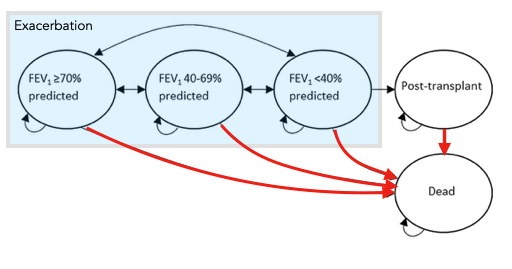

### Background & Data description
Just a simple markov model, based on a paper by Tappenden, Sadler & Wildman, about an early evaluation of the cost-effectiveness of an adherence intervention to improve outcomes for patients with cystic fibrosis. The results show that the intervention clearly dominates the baseline treatment. 

For details, see their [Journal article](https://doi.org/10.1007/s40273-017-0500-x).

### Problems & Questions
The model was originally implemented in Excel. I translated it into R as part of a research attachment on VOI. The code is neither very tidy nor fast, but it might serve as a sample model, for example to create some plots, build a shiny-application or play around with parallelisation. 

### Possible techniques & approaches
ggplot2, shiny, foreach, evppi

### Any additional access restrictions that need to be incorporated for the data
The code can be distributed, re-used, and modified.

#### Contact
Paul Schneider  
University of Sheffield  
p.schneider@sheffield.ac.uk  
https://bitowaqr.github.io/  
